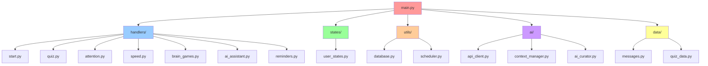
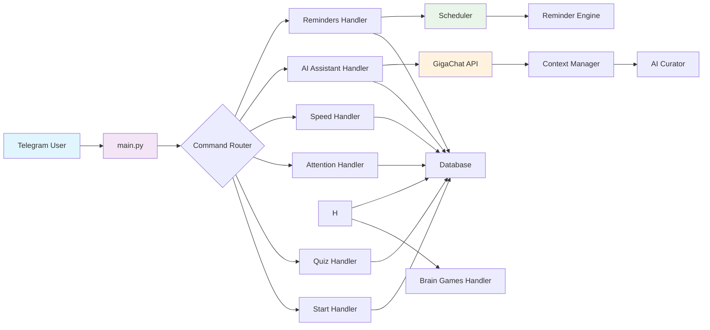
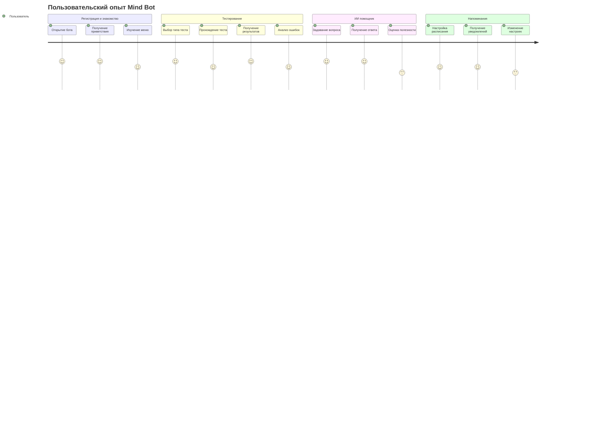
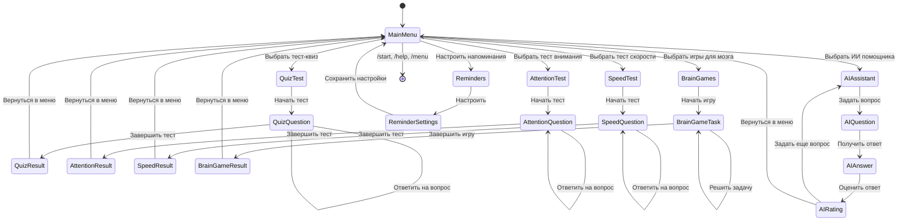
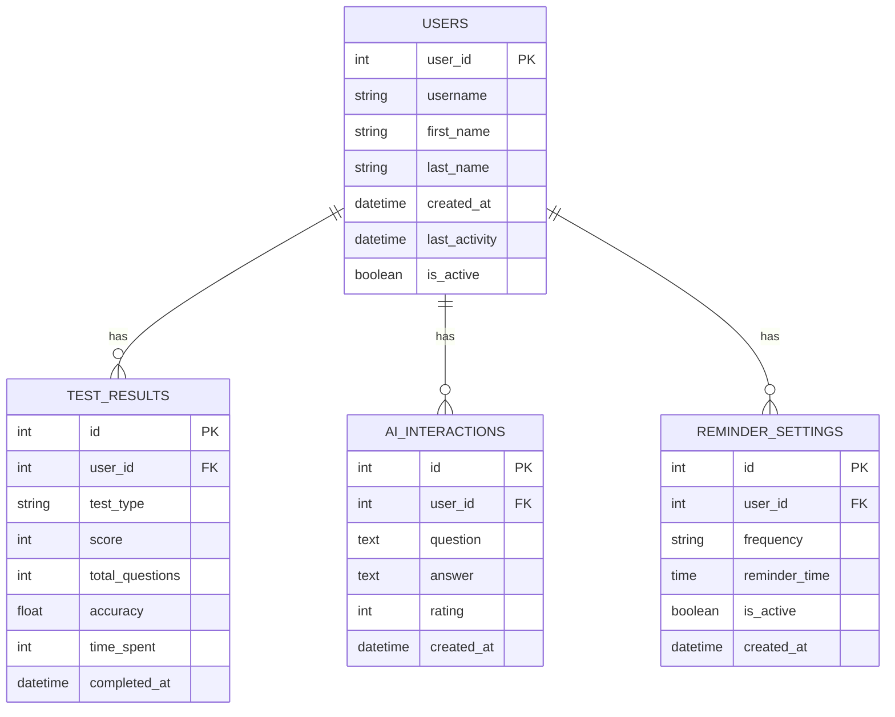
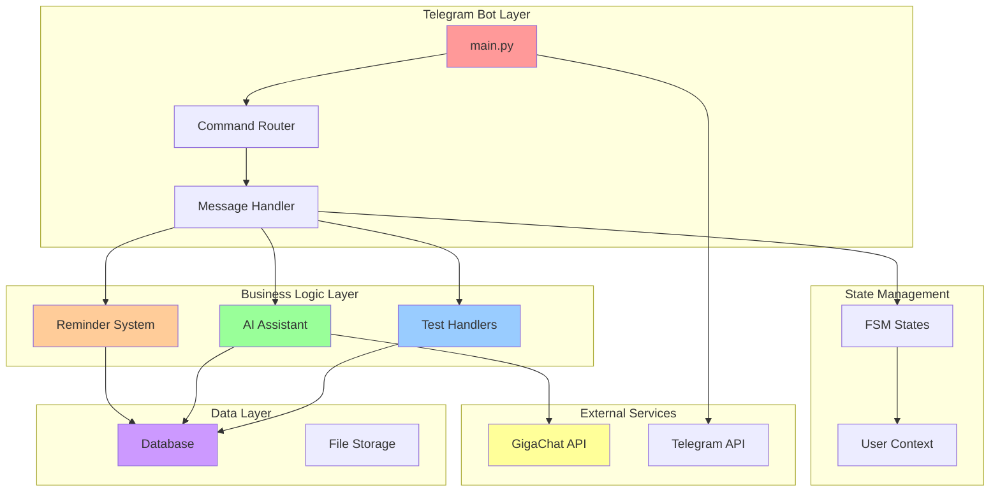
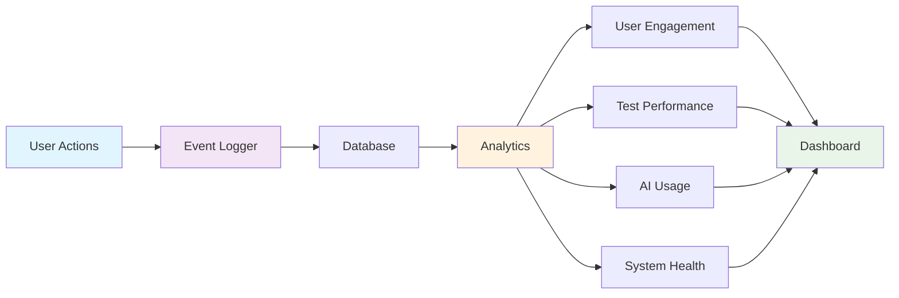
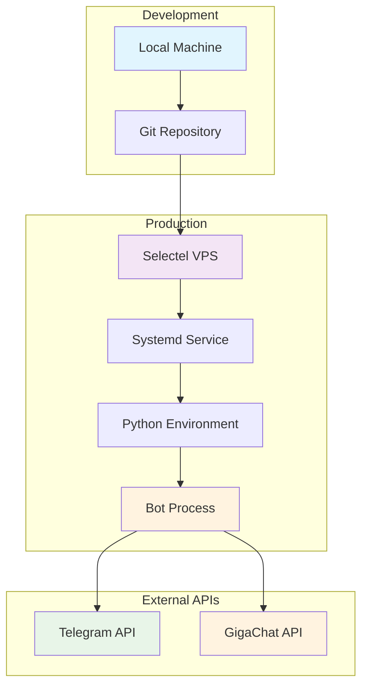

# 🏗 Архитектура Mind Bot

## 📊 Структура проекта

## 🔄 Поток данных

## 🎯 User Stories

### 👤 Основные пользовательские сценарии

## 🧠 Состояния пользователя (FSM)

## 🗄 База данных

## 🔧 Компонентная архитектура

## 📈 Метрики и мониторинг

## 🚀 Деплой архитектура

