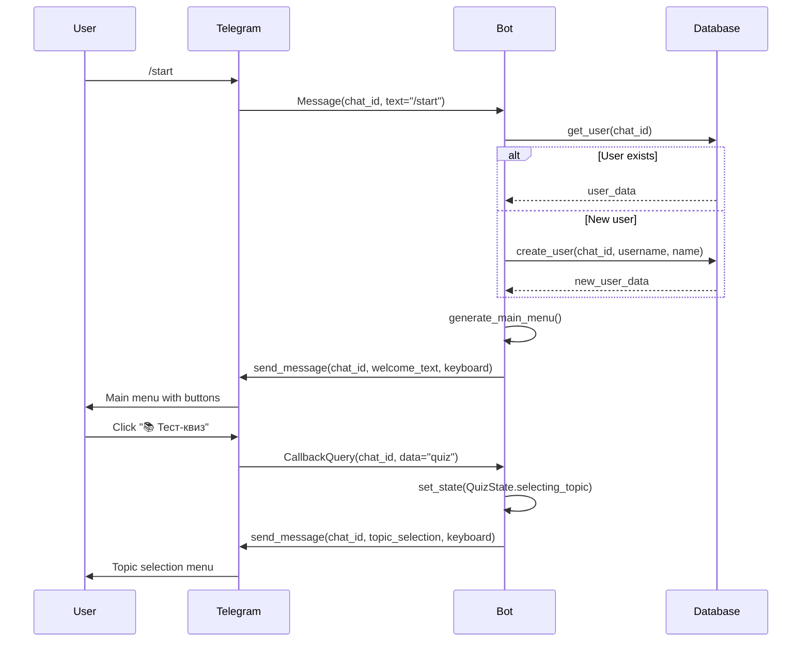
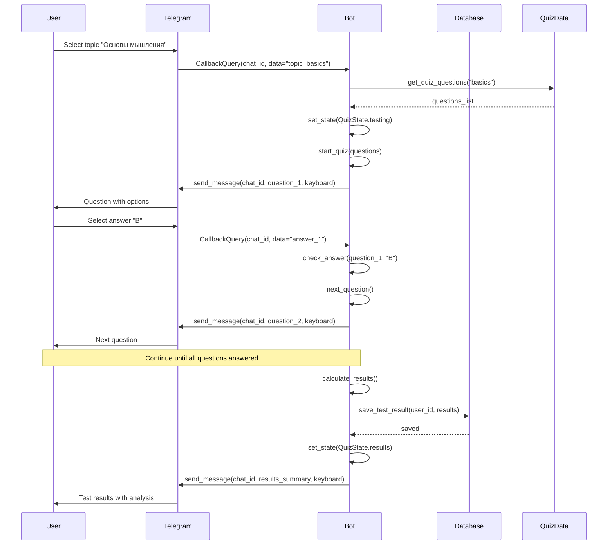
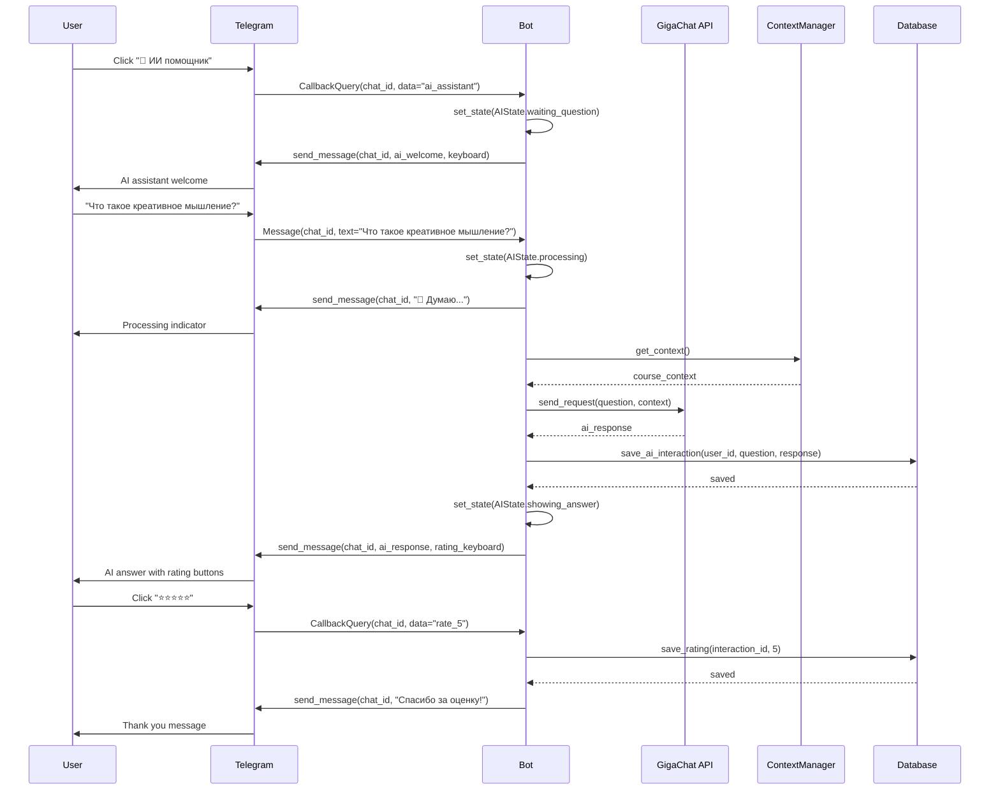
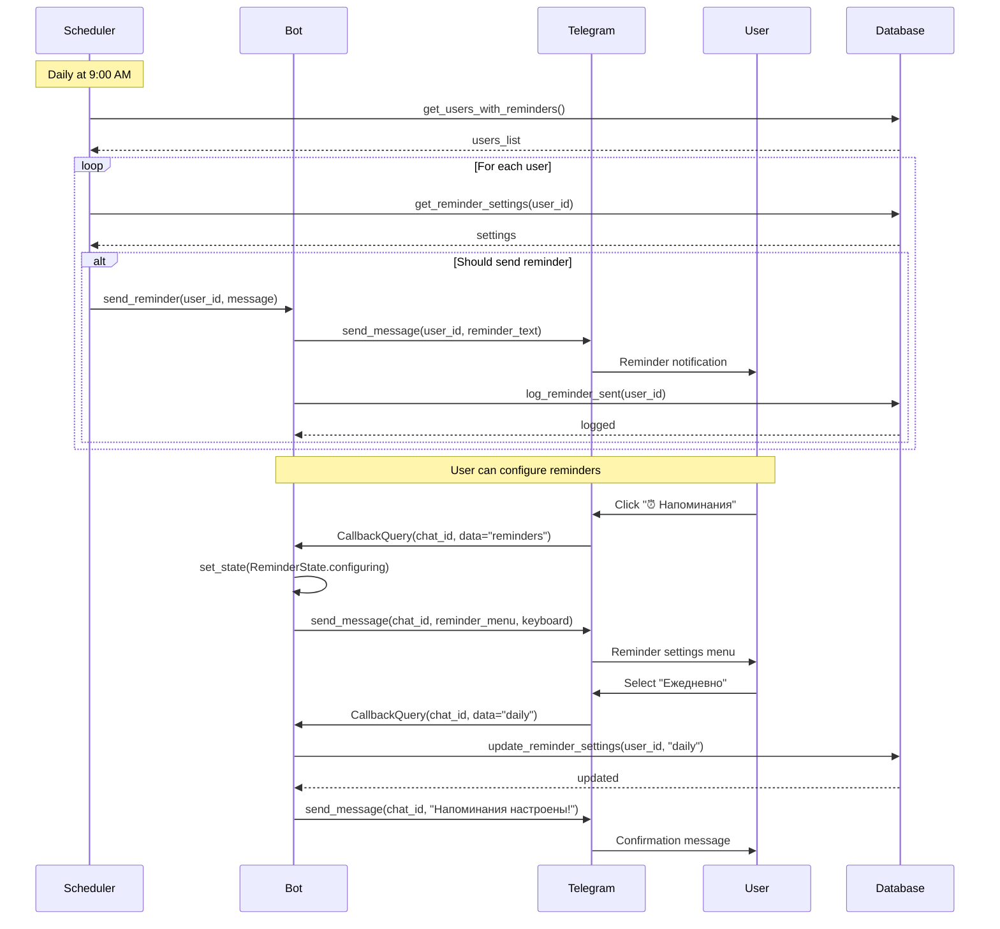
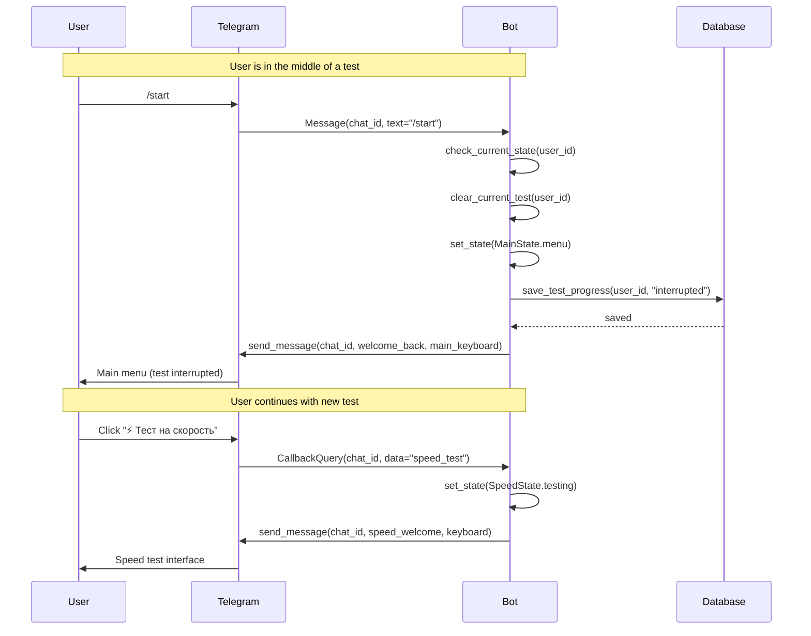
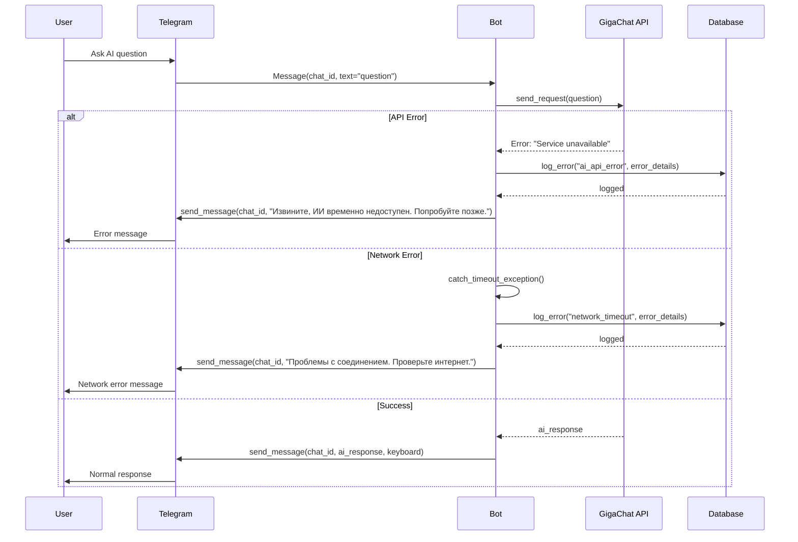
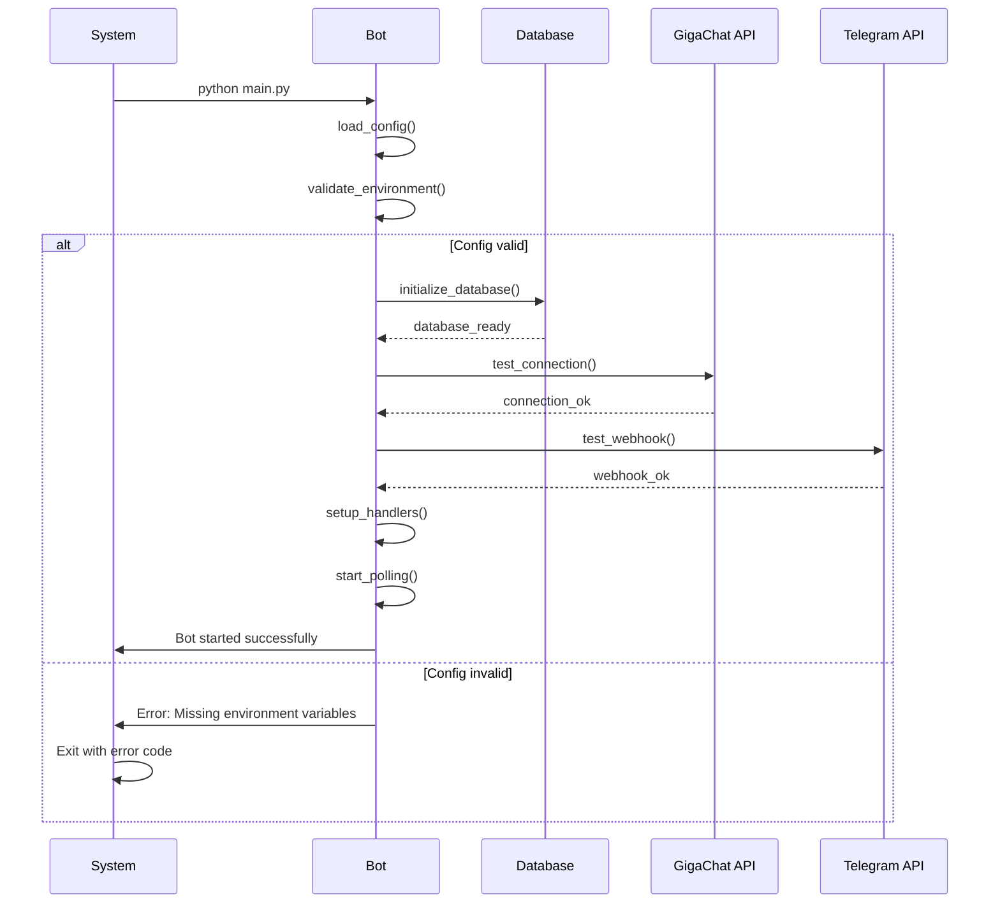
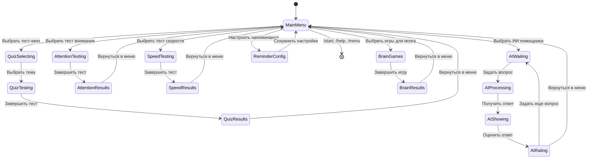
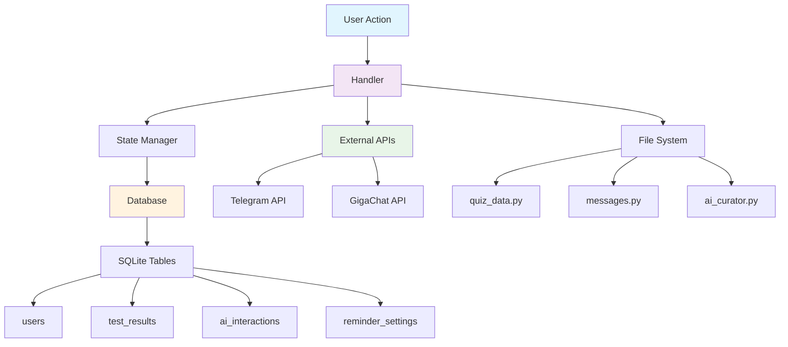

# 🔄 Диаграммы последовательности - Mind Bot

## 📱 Основные сценарии взаимодействия

### 1. Запуск бота и навигация

### 2. Прохождение тест-квиза

### 3. Взаимодействие с ИИ помощником

### 4. Система напоминаний

### 5. Обработка команд во время тестов

### 6. Обработка ошибок

### 7. Инициализация и запуск бота

## 🔧 Технические детали

### Состояния FSM (Finite State Machine)

### Поток данных в базе

